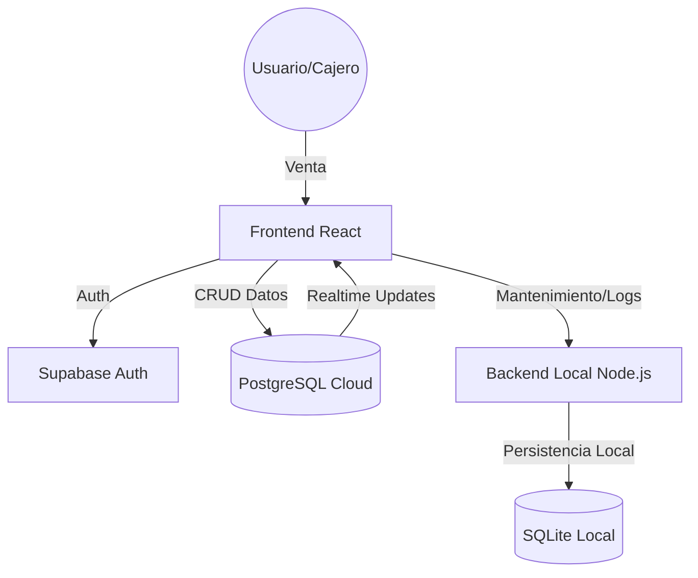

# 📊 Análisis de Proyecto: Sistema Ventas LAVANDERIA

Este documento proporciona una visión detallada del estado actual del proyecto, sus capacidades técnicas, y una hoja de ruta para su crecimiento y escalabilidad.

---

## 🏗️ Arquitectura del Sistema

El sistema utiliza una **Arquitectura Híbrida** diseñada para ofrecer robustez tanto en la nube como en entornos locales de escritorio.

- **Frontend**: React 19 + Vite (SPA moderna, rápida y reactiva).
- **Backend Global**: Supabase (PostgreSQL + Auth + Row Level Security).
- **Backend Local**: Node.js + Express + SQLite (Empaquetado con Electron para control de terminal y mantenimiento).
- **Desktop**: Electron (Contenedor que permite acceso a hardware y ejecución de procesos locales).

---

## ✅ Puntos Fuertes (Strengths)

1. **Aislamiento Multi-tienda (Multi-tenancy)**: Gracias al uso de Supabase RLS (Row Level Security), los datos de cada cliente están aislados a nivel de base de datos, lo que permite escalar el sistema como un SaaS con alta seguridad.
2. **Soporte Offline/Local Progresivo**: La inclusión de un backend local y SQLite permite una base para futuras capacidades offline y una gestión de terminales más granular que una simple aplicación web.
3. **Tecnología de Vanguardia**: El uso de React 19 y Vite 7 posiciona al proyecto en el estado del arte del desarrollo frontend, facilitando el mantenimiento a largo plazo.
4. **Seguridad y Auditoría**: El sistema cuenta con un módulo de "Soporte Forense" y logs administrativos que permiten rastrear acciones críticas y realizar resets seguros del sistema.
5. **Experiencia de Usuario (UI/UX)**: Diseño premium orientado a la eficiencia en el punto de venta (escaneo de códigos de barras, búsqueda rápida, tickets).

---

## ❌ Puntos Débiles (Weaknesses)

1. **Dependencia de la Nube para Operaciones Core**: Aunque existe un backend local, las ventas y el inventario dependen actualmente de la conectividad con Supabase de forma síncrona. Si el internet falla, el POS se ve limitado.
2. **Complejidad de Despliegue**: Tener que gestionar un frontend en Vercel, un backend en Supabase y un instalador de Electron aumenta la fricción para nuevos clientes.
3. **Falta de Pruebas Automatizadas**: No se observan suites de pruebas unitarias o de integración robustas, lo que aumenta el riesgo de regresiones al añadir nuevas funciones.
4. **Manejo de Imágenes**: El uso de Base64 o URLs externas para imágenes de productos puede afectar el rendimiento si el catálogo crece significativamente sin una estrategia de optimización de assets.

---

## 🚀 Mejoras y Actualizaciones Recomendadas

### 🛠️ Técnicas (Mantenibilidad)

- **Implementar Sincronización Local (Offline First)**: Modificar los servicios para que escriban primero en SQLite y sincronicen con Supabase en segundo plano.
- **Suite de Pruebas**: Añadir Vitest para lógica de negocio y Playwright para flujos críticos de venta.
- **Refactorización de Servicios**: Consolidar la lógica de interacción con APIs para evitar duplicidad entre el flujo local y global.

### 🌟 Funcionales (Valor de Negocio)

- **Módulo de Lavandería Especializado**: Añadir estados de orden (Recibido, Lavando, Secando, Listo, Entregado) y pesaje automático desde básculas.
- **Dashboard de Analítica Avanzada**: Integrar reportes visuales de tendencias de ventas y productos estrella.

---

## 🔄 Flujo de Base de Datos

### Diagrama de Flujo de Datos

### Relaciones Clave

- **Profiles ↔ Users**: Relación 1:1 para configuración de tienda.
- **Sales ↔ Sale_Items**: Relación 1:N que registra el detalle transaccional.
- **Products ↔ Users**: Aislamiento por `user_id` para garantizar que cada tienda vea solo su inventario.
- **Terminals ↔ Sales**: Permite identificar desde qué punto de venta físico se realizó cada operación.

---

## 📈 Plan de Implementación para Expansión

### Fase 1: Consolidación (1-2 meses)

- Implementar **Offline First** para garantizar ventas sin internet.
- Configurar un **Pipeline de CI/CD** para despliegues automatizados de Electron.

### Fase 2: Escalabilidad Multi-Sucursal (3-6 meses)

- **Gestión Multi-Tienda**: Permitir que un Propietario gestione múltiples sucursales compartiendo o separando inventarios.
- **Transferencias entre Sucursales**: Módulo para mover stock de una ubicación a otra.

### Fase 3: Ecosistema Digital (6+ meses)

- **App de Cliente**: Permitir que los clientes finales vean el estado de sus prendas mediante un código QR en el ticket.
- **Notificaciones Automáticas**: Enviar avisos vía WhatsApp/Email cuando la ropa esté lista.

---

_Análisis generado por Antigravity (Advanced Agentic Coding)_
